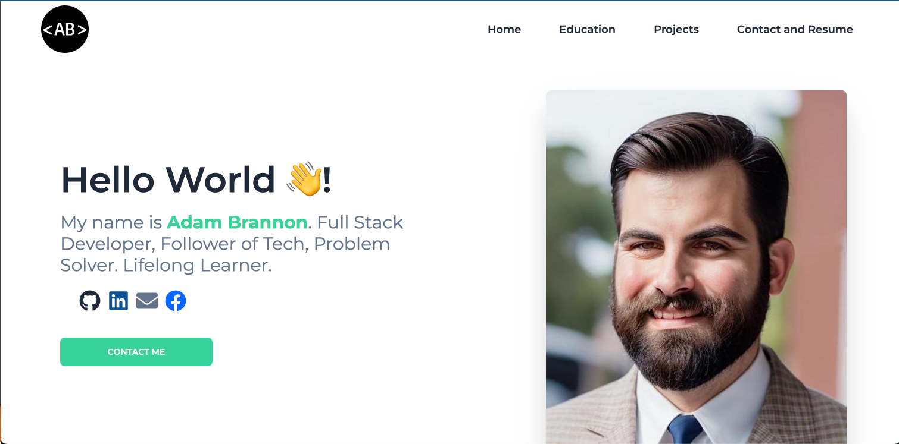

<link rel="stylesheet" href="https://cdn.jsdelivr.net/gh/devicons/devicon@v2.15.1/devicon.min.css">

          
          
# React Portfolio v2.0 

## Description
Web Developer Portfolio built using React. Consists of a home, education, experience, projects, and contact page.

## Quick Links

- [Installation](#installation)

- [Technologies](#technologies)

- [Demo](#demo)
  
- [Feedback and Support](#feedback-and-support)
  
- [License](#license)

## Installation

- No install required for the web-based version. 
- To run the application locally, clone the repository to your local machine then:
  - Install the dependencies by running `npm install` in the root directory
  - Run `npm start` to start the application
  - Navigate to `localhost:3000` in your browser to use the application

## Technologies

          

## Demo

Follow me to the [Deployed Application](https://portfolio-nine-lemon-49.vercel.app/)

[Check me out on Github](https://github.com/adam-brannon09)

[Email Me](mailto:adam.brannon09@icloud.com)

## Feedback and Support

If you encounter any issues while viewing Weather Dashboard v2.0 or have any suggestions for improvement, please [open an issue](https://github.com/adam-brannon09/portfolio/issues) on the GitHub repository. I appreciate your feedback and will address any concerns as soon as possible.

## License

Weather Dashboard v2.0 is released under the [MIT License](https://opensource.org/licenses/MIT). You are free to use, modify, and distribute this application as per the terms of this license.

    

